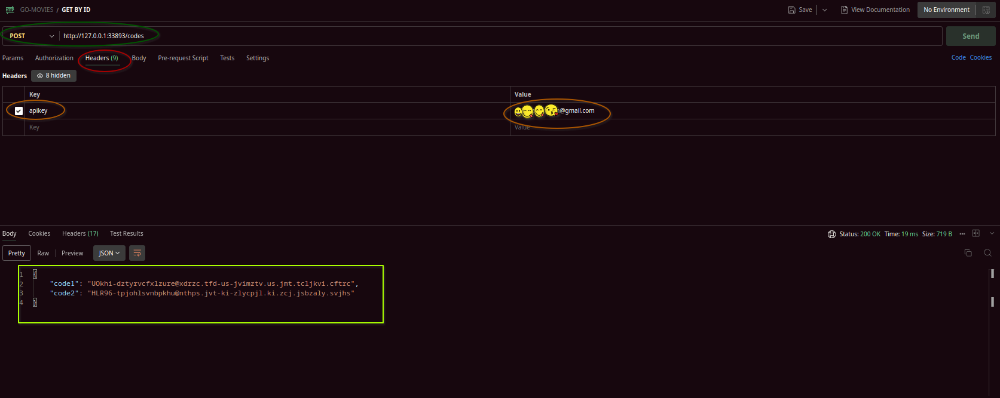

# 🚀 Setting Up Your Own Kubernetes Cluster with Minikube! 🌌

Welcome to the intergalactic journey of setting up your very own Kubernetes cluster using Minikube! In this adventure, we'll embark on a mission to deploy two containers, a app and PostgreSQL database, safely housed in their own namespace. 🛸

## 📦 Prerequisites

To begin your cosmic journey, make sure you have the following spacecraft ready:

- **Minikube**: Your trusty spaceship for launching Kubernetes clusters. [Install Minikube](https://minikube.sigs.k8s.io/docs/start/)
- **kubectl**: Your universal translator for communicating with Kubernetes clusters. [Install kubectl](https://kubernetes.io/docs/tasks/tools/install-kubectl/)

## 🛰️ Let the Journey Begin

1. **Prepare for Launch 🚀**: Fire up your Minikube spaceship and get ready for liftoff! Execute the following command to start your journey. The procees will take some times for the first time:

   ```bash
   $ minikube start
   ```
    Check that  everything is running properly by executing this command in your terminal. If everything has been set up correctly,

    ```bash
    $ minikube status
    # the result
    minikube
    type: Control Plane
    host: Running
    kubelet: Running
    apiserver: Running
    kubeconfig: Configured
    ```

2. **Create Cosmic Realms 🪐**: Create separate cosmic realms (namespaces) for the application and the accompanying PostgreSQL database you can refer to namespace yaml files ([app-namespace.yaml](app-namespace.yaml), [db-namespace.yaml](db-namespace.yaml)) so we just apply them to our cluster:

   ```bash
   kubectl apply -f db-namespace.yaml
   kubectl apply -f app-namespace.yaml
   ```
3. **📄 Database Secret Configuration 🗄️**: This describes the [db-secret.yaml](db-secret.yaml) and [app-secret.yaml](app-secret.yaml) files which is a Kubernetes Secret object. This Secret object is used to store sensitive information like username and password for example a database.

   ```bash
    kubectl apply -f db-secret.yaml
    kubectl apply -f app-secret.yaml
   ```
   **🏴‍☠️ Usage 🏴‍☠️**
This Secrets can be used by other brave Kubernetes objects, like Pods to access the database. The username and password are stored as base64 encoded strings and must be decoded before use. This is like using a secret decoder ring to read a hidden message! This allows our precious treasure (sensitive data) to be stored safely in the castle (cluster). 🏰🔐

4. **Open the Cosmic Gates 🌌**: We're going to navigate the mysterious [db-service.yaml](db-service.yaml) and [app-service.yaml](app-service.yaml) files. This files is like our trusty map 🗺️ guiding us to our database service and app. In other word they expose our database and app!
   ```bash
   kubectl apply -f db-service.yaml
   kubectl apply -f app-service.yaml
   ```
   **🏴‍☠️ Usage 🏴‍☠️**
This Services acts like a lighthouse, guiding network traffic to our Pods. Any traffic that comes to port 5432 and 8080 on our Services will be directed to port 5432 and 8080 on the Pods that match the app: db and app: app labels, as define in the files. It's like a well-organized harbor operation! 🚢⚓️

5. **🎉 The Secret Scroll of Docker Registry Credentials 🎉**:  We're going to decipher the cryptic [app-reg.yaml](app-reg.yaml) scroll. This scroll is like a secret treasure map 🗺️ leading us to the hidden Docker registry credentials for our private image "app-test"!
   ```bash
   kubectl apply -f app-reg.yaml
   ```
   **🏴‍☠️ Usage 🏴‍☠️**
This Secret is use to pull Docker images from a private Docker registry. The .dockerconfigjson is stored as a base64 encoded string and must be decoded before use. This is like using a secret decoder ring to read a hidden message! This allows our precious treasure (sensitive data) to be stored safely in the castle (cluster). 🏰

6. **🎉 The Magical Map of Application Configuration 🎉**: We're going to decipher the mystical [app-config.yaml](app-config.yaml) scroll. This scroll is like a magical map 🗺️ that guides our application to its database!

   ```bash
   kubectl apply -f app-config.yaml
   ```
   **🏴‍☠️ Using the Map (Usage) 🏴‍☠️**
This ConfigMap can be used by our brave application (a Kubernetes Pod) to find its way to the database. The db-url is like a magical spell that points the application to the right path by using define DNS address. This allows our application to navigate the mysterious world of the Kubernetes cluster and find its database treasure! 🏰🔐

7. **Deploy Space Stations 🛸**: We're going to embark on an epic journey through the [app-deployment.yaml](app-deployment.yaml) scroll. This scroll is like a detailed plan 🗺️ for our grand adventure, guiding us to deploy our application and database in the Kubernetes cluster!
through the [db-statefulset.yaml](db-statefulset.yaml) files. This files is like a legendary tale 📜 that narrates the deployment of our application and database in the Kubernetes cluster!

   ```bash
   kubectl apply -f db-statefulset.yaml
   kubectl apply -f app-deployment.yaml
   ```

   **🏴‍☠️ Usage 🏴‍☠️**
This Deployment sets forth our brave application (a Kubernetes Pod) on its grand adventure. It tells Kubernetes how to create and manage our application, including how to find its Docker image that is on the private registry, how to configure its environment, and how to expose its ports. It's like a detailed plan for a grand adventure in the- Kubernetes cluster! 🏰🔐  
This StatefulSet sets forth our brave database (a Kubernetes Pod) on its epic saga. It tells Kubernetes how to create and manage our database, including how to find its Docker image, how to configure its environment, and how to expose its ports. It's like a detailed plan for a grand adventure in the Kubernetes cluster! 🏰🔐  

8. **Write into the /app/data/email.txt**: In order to to make our POST request on the we have register first our email in the /app/data/email.txt of the container running the app application.  
 First thing first we have find the exact name of the pod runnig our container **app-test**, if you use the **"app-deployment"** name that we provide in [app-deployment.yaml](app-deployment.yaml) file it won't work.
   
   ```bash
   kubectl get pods -n app
 
   # We get this.  

   NAME                             READY   STATUS    RESTARTS        AGE
   app-deployment-86dcffb65-pq2jf   1/1     Running   1 (9m35s ago)   47h  
   ```
   On marchine we get **app-deployment-86dcffb65-pq2jf** but you won't get the same.  
   Now we are going to execute this command to log inside the container.
   ```bash
   kubectl exec -it -n app app-deployment-86dcffb65-pq2jf -- sh
   # We get this
   /app $
   # Then you do cd data, because we are already in the /app directory
   /app $ cd data
   # Now we can write into email.txt file
   /app/data $ echo "youremail@example.com" > email.txt
   ```

9. **Discover Cosmic Coordinates 🌠**: Uncover the cosmic coordinates (URLs) to access your deployed application.  
When using Minikube with the Docker driver on macOS, Windows, or WSL, there are network limitations that can affect how services are accessed and exposed within the Kubernetes cluster. Additionally, on Linux with the Docker driver, no tunnel is created by default, which can further impact network accessibility. So we have to create a tunnel to access our service  
Services of type NodePort can be exposed via the **minikube service service-name --url** command. It must be run in a separate terminal window to keep the tunnel open. Ctrl-C in the terminal can be used to terminate the process at which time the network routes will be cleaned up:

   ```bash
   minikube service app-service --url -n app
   # Output
   http://127.0.0.1:33893
   ❗  Because you are using a Docker driver on linux, the terminal needs to be open to run it.
   ```
   When you cast this cmd in your terminal, Minikube will return the URL of the app-service in the app namespace. You can use this URL to interact with your service, like opening a portal to another realm! 🌀✨  
   Now we a post request to do so we can get back some codes from the application using **Postman**. We are going to make our POST request on this  
   **url**: http://127.0.0.1:33893/codes/  
   **Request type**: POST  
   **Headers**: apikey: youremail@example.com

   **Here is what your  request should look like, if it's successful**  
   

## 🌟 Wrapping Up Your Cosmic Adventure

To complete your cosmic journey and return to Earth, don't forget to clean up your spacecraft and cosmic realms:

   ```bash
   minikube delete
   ```

## 🚀 Blast Off Into the Cosmos

Congratulations, cosmic explorer! You've successfully set up your own Kubernetes cluster with Minikube, an application and its PostgreSQL database living in its own cosmic realm. 🪐 Now, it's time to embark on your own adventures in the vastness of the Kubernetes universe!

***This DOC takes you on a space adventure, guiding you through the steps of setting up your Kubernetes cluster with Minikube. It includes emoji icons and fun language to make the process engaging and enjoyable. Now, prepare for liftoff and explore the Kubernetes universe! 🚀🌌🪐***
